# 🎭# 🎮 전래동화 리부트: 콩쥐의 선택 (Kongjwi's Reboot)

[](https://ai-interactive-game.onrender.com/)

> **"항아리에 물을 붓지 마라. 깨어라."**
> AI와 함께 써내려가는 신개념 인터랙티브 텍스트 어드벤처 게임

[](https://yonghwan-ko02.github.io/Project/)
[](LICENSE)
[](https://www.python.org/)
[](https://deepmind.google/technologies/gemini/)

---

### 🌐 지금 바로 플레이하세요! (Cloud)
**[👉 게임 실행하기 (https://ai-interactive-game.onrender.com)](https://ai-interactive-game.onrender.com/)**

---

### ✨ 주요 특징 (New!)

- 📱 **모바일 최적화**: 스마트폰에서도 쾌적하게 즐길 수 있는 반응형 UI 지원
- 🛠️ **실시간 로그 패널**: AI의 사고 과정과 시스템 로그를 웹에서 실시간으로 확인 가능
- ☁️ **하이브리드 모드**:
    - **Cloud**: Google Gemini로 고성능 플레이 (설치 불필요)
    - **Local**: Ollama로 내 PC에서 무제한 무료 플레이
- 🎭 **다양한 페르소나**: 클래식, 사투리, 냉소적, 그리고 **파격적(Radical)** 스토리텔링
- 🧠 **RAG 기술**: 원작 지식을 활용하여 엉뚱하지만 개연성 있는 스토리 전개

---

## 🚀 빠른 시작

### 사전 요구사항

- **Python 3.10 이상**
- **Google Gemini API Key** ([발급받기](https://aistudio.google.com/app/apikey))
- (선택) 로컬 모드 사용 시: **Ollama**

### 설치 및 실행

```bash
# 1. 저장소 클론
git clone https://github.com/yonghwan-ko02/Project.git
cd Project

# 2. 가상환경 생성 및 활성화
python -m venv .venv
source .venv/bin/activate  # Windows: .venv\Scripts\activate

# 3. 의존성 설치
pip install -r requirements.txt

# 4. 환경 변수 설정 (.env 파일 생성)
# .env 파일을 만들고 아래 내용을 추가하세요:
# GOOGLE_API_KEY=your_api_key_here

# 5. 게임 실행
python web_server.py
```

브라우저에서 `http://localhost:8001`에 접속하여 플레이하세요.

---

---

## 🏗️ 시스템 아키텍처 (System Architecture)

이 프로젝트는 **FastAPI** 기반의 비동기 백엔드와 **Ollama/Gemini** 하이브리드 AI 엔진을 결합하여, 실시간 상호작용이 가능한 이벤트 기반 아키텍처(Event-Driven Architecture)로 설계되었습니다.

### 📐 데이터 흐름도 (Data Flow)

```mermaid
graph LR
    %% Styles
    classDef user fill:#FF9F43,stroke:#333,stroke-width:2px,color:white;
    classDef frontend fill:#54a0ff,stroke:#333,stroke-width:2px,color:white;
    classDef backend fill:#5f27cd,stroke:#333,stroke-width:2px,color:white;
    classDef ai fill:#1dd1a1,stroke:#333,stroke-width:2px,color:white;
    classDef storage fill:#8395a7,stroke:#333,stroke-width:2px,color:white;

    %% Nodes
    Player([🙋‍♂️ User])
    WebUI[📱 Web Frontend]
    Server[🚀 FastAPI Server]
    
    subgraph "Core Logic"
        Session(GameSession)
        DM[🧠 DungeonMaster]
        State[📊 GameState]
    end
    
    subgraph "Data & AI"
        LK[📚 LoreKeeper]
        VectorDB[(💾 ChromaDB)]
        LLM((🤖 LLM Engine))
    end

    %% Connections
    Player <==>|WebSocket| WebUI
    WebUI <==>|Async JSON| Server
    
    Server -->|Manage| Session
    Session -->|Control| DM
    Session -->|Track| State
    
    DM <-->|Generate| LLM
    DM -->|Query| LK
    LK <-->|Retrieve| VectorDB
    
    %% Apply Styles
    class Player user;
    class WebUI frontend;
    class Server,Session,DM,State backend;
    class LLM,LK ai;
    class VectorDB storage;
```



---

## 💡 기술적 핵심 역량 (Core Competencies)

이 프로젝트를 통해 다음과 같은 풀스택 및 AI 엔지니어링 역량을 증명합니다.

### 1. Advanced AI Application (RAG & Prompt Engineering)
- **Hybrid AI Pipeline**: 비용 효율적인 로컬 LLM(Ollama)과 고지능 클라우드 LLM(Gemini)을 상황에 따라 전환하는 **Strategy Pattern** 적용.
- **RAG (Retrieval-Augmented Generation)**: LangChain과 ChromaDB를 활용하여 원작 소설의 문맥을 검색, 환각(Hallucination)을 줄이고 캐릭터 일관성을 유지.
- **Dynamic Prompting**: 게임 상태(State)와 사용자 선택(History)에 따라 시스템 프롬프트를 동적으로 재구성하여 스토리의 개연성 확보.

### 2. Modern Backend Engineering
- **Asynchronous Processing**: `asyncio`를 활용한 완전 비동기 처리로, 다수의 클라이언트가 접속해도 블로킹 없는 쾌적한 WebSocket 통신 구현.
- **Thread-Safety**: 동기(Sync) 방식의 RAG 로직과 비동기(Async) 방식의 통신 로직 간의 충돌 방지를 위해 `run_coroutine_threadsafe` 패턴 적용.
- **Design Patterns**: 
    - **Singleton**: LoreKeeper(지식 베이스) 인스턴스 재사용으로 메모리 최적화.
    - **Finite State Machine (FSM)**: 게임의 상태(Neutral -> Reboot/Original) 전이 관리.

### 4. Reliability & Scalability (BYOK System)
- **Auto-Failover**: Google API Quota Exceeded (429) 에러 발생 시, 시스템이 즉시 감지하고 사용자에게 알림.
- **Hot-Swapping**: 게임 중단 없이 실시간으로 API Key를 교체(Client-Side Injection)하여 서비스를 지속시키는 **BYOK(Bring Your Own Key)** 아키텍처 구현.

### 3. Full-Stack Implementation
- **Responsive Web UI**: Mobile-First 접근 방식으로 설계된 반응형 웹 인터페이스 (CSS Grid/Flexbox).
- **Deployment**: Docker 컨테이너 개념을 활용한 Render 클라우드 배포 및 환경 변수(`$PORT`)를 통한 동적 바인딩 처리.
- **Clean Architecture**: UI(Web/Console), Business Logic(GameLoop), Data(LoreKeeper) 계층의 명확한 분리.

---

## 🧩 핵심 모듈 상세


## 🎮 게임 플레이

### 게임 흐름

1. **오프닝**: 익숙한 "밑 빠진 독에 물 붓기" 장면에서 시작
2. **선택의 순간**: 원작대로 따를 것인가, 거부할 것인가?
3. **AI 반응**: 당신의 선택에 따라 AI가 새로운 스토리 생성
4. **결말**: 원작과 완전히 다른 엔딩을 경험

### 예시 시나리오

```
[내레이션] 두꺼비가 밑 빠진 독을 고쳐주겠다고 합니다.

당신의 선택은?
1. 두꺼비를 도와준다 (원작)
2. 두꺼비를 무시한다
3. 직접 입력: _____

> 두꺼비를 발로 찬다

[AI 생성] 두꺼비는 놀라 도망갑니다. 
은혜를 갚을 기회를 잃은 두꺼비는 다시 돌아오지 않았습니다...
```

---

## 📚 문서

- **[PRD.md](docs/PRD.md)**: 제품 요구사항 명세서 - 프로젝트의 목표와 기능 정의
- **[Tutorial.md](docs/Tutorial.md)**: 단계별 제작 가이드
- **[Task.md](docs/Task.md)**: 개발 작업 목록 및 진행 상황
- **[GitHub Actions 설명](docs/GitHub-Actions-설명.md)**: CI/CD 워크플로우 이해하기

---

## 🧩 핵심 모듈

### 1. LoreKeeper (지식 관리자)
- 원작 텍스트를 벡터 DB에 저장
- 게임 상황에 맞는 원작 정보 검색 (RAG)
- 캐릭터 페르소나 일관성 유지

### 2. DungeonMaster (게임 마스터 AI)
- 사용자 입력 + 원작 지식 → 새로운 스토리 생성
- 인과관계 처리 및 캐릭터 성격 유지
- TRPG 마스터 역할 수행

### 3. GameLoop (메인 실행기)
- 턴제 텍스트 입출력 처리
- 대화 히스토리 관리 (메모리)
- 컨텍스트 윈도우 최적화

---

## 🎯 개발 로드맵

- [x] 프로젝트 기획 및 문서화
- [x] GitHub 저장소 설정
- [x] GitHub Pages 자동 배포 설정
- [x] 데이터 준비 (story.txt - 120줄, 8개 챕터)
- [x] LoreKeeper 구현 (RAG with retry logic & fallback)
- [x] DungeonMaster 구현 (AI 엔진 with GameState integration)
- [x] GameState 구현 (선택 추적 및 분기 로직)
- [x] GameLoop 구현 (UI/UX with meta commands)
- [x] Logger 구현 (세션 기록)
- [x] 테스트 및 버그 수정 (Complete)
- [x] 실제 Ollama 통합 테스트 (Verified)
- [x] 모바일 UI 및 반응형 웹 지원
- [x] 개발자 로그 패널 추가
- [x] 클라우드 배포 (Render)

**현재 진행 상황**: 모든 핵심 기능 구현 완료 및 배포됨.

자세한 내용은 [Walkthrough](file:///c:/Users/KO/.gemini/antigravity/brain/e2aa7043-3bb3-4e41-8db8-1a20ed0c435f/walkthrough.md)를 참고하세요.

---

## 🆕 새로운 기능

### GameState 시스템
- 플레이어 선택 자동 추적
- 리부트 점수 계산 (0-100)
- 3가지 엔딩 타입 (ORIGINAL/REBOOT/NEUTRAL)

### 메타 명령어
- `help`: 도움말 표시
- `status`: 현재 게임 상태 확인
- `restart`: 게임 재시작
- `quit`: 게임 종료

### 고급 기능
- **에러 처리**: Ollama 연결 실패 시 재시도 (exponential backoff)
- **Fallback 모드**: Vector DB 실패 시 키워드 검색
- **세션 로깅**: JSONL 형식으로 게임 기록 저장
- **Rich UI**: 컬러풀한 터미널 출력 및 로딩 스피너

---

## 🤝 기여하기

이 프로젝트는 학습 목적으로 제작되었습니다. 기여를 환영합니다!

1. Fork the Project
2. Create your Feature Branch (`git checkout -b feature/AmazingFeature`)
3. Commit your Changes (`git commit -m 'Add some AmazingFeature'`)
4. Push to the Branch (`git push origin feature/AmazingFeature`)
5. Open a Pull Request

---

## 📄 라이선스

이 프로젝트는 MIT 라이선스 하에 배포됩니다. 자세한 내용은 [LICENSE](LICENSE) 파일을 참조하세요.

---

## 🙏 감사의 말

- **Ollama**: 로컬 LLM 실행 환경 제공
- **LangChain**: RAG 파이프라인 구축 프레임워크
- **ChromaDB**: 서버리스 벡터 데이터베이스
- **전래동화 《콩쥐팥쥐》**: 영감의 원천

---

## 📧 연락처

프로젝트 관련 문의: [GitHub Issues](https://github.com/yonghwan-ko02/Project/issues)

---

<div align="center">

**Made with ❤️ and 🤖 AI**

[Documentation](docs/) · [Report Bug](https://github.com/yonghwan-ko02/Project/issues) · [Request Feature](https://github.com/yonghwan-ko02/Project/issues)

</div>
