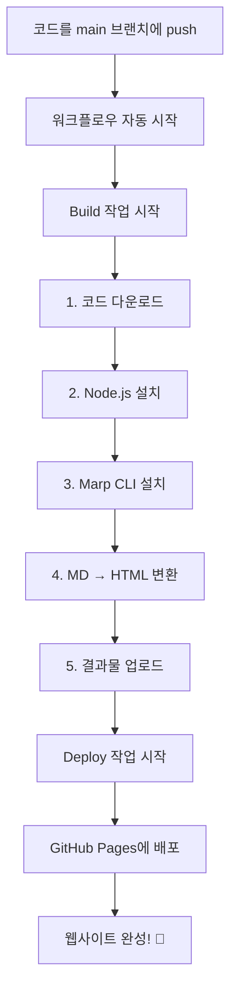

# GitHub Actions 워크플로우 쉽게 이해하기 🚀

> 이 문서는 `.github/workflows/marp-to-pages.yml` 파일이 어떻게 작동하는지 고등학생도 이해할 수 있도록 설명합니다.

## 🎯 이 파일이 하는 일

이 파일은 **자동화 로봇**입니다! 여러분이 코드를 GitHub에 올리면, 자동으로:
1. 📝 Marp 프레젠테이션 파일(`.md`)을 웹페이지(`.html`)로 변환
2. 🌐 GitHub Pages에 자동으로 배포

**쉽게 말하면**: 여러분이 발표 자료를 수정하고 저장하면, 자동으로 인터넷에 올라가서 누구나 볼 수 있게 됩니다!

---

## 📋 전체 구조 한눈에 보기

```
┌─────────────────────────────────────┐
│  1. 언제 실행할까? (on)             │
│     - main 브랜치에 코드 올릴 때    │
│     - 수동으로 실행 버튼 누를 때    │
└─────────────────────────────────────┘
           ↓
┌─────────────────────────────────────┐
│  2. 권한 설정 (permissions)         │
│     - 파일 읽기 권한                │
│     - 웹페이지 배포 권한            │
└─────────────────────────────────────┘
           ↓
┌─────────────────────────────────────┐
│  3. 작업 실행 (jobs)                │
│     ├─ 빌드 작업 (build)            │
│     └─ 배포 작업 (deploy)           │
└─────────────────────────────────────┘
```

---

## 📖 코드 한 줄씩 이해하기

### 1️⃣ 워크플로우 이름 정하기

```yaml
name: Marp to GitHub Pages
```

**의미**: 이 자동화 작업의 이름을 "Marp to GitHub Pages"라고 정했어요.
- GitHub의 Actions 탭에서 이 이름으로 보입니다.

---

### 2️⃣ 언제 실행할지 정하기

```yaml
on:
  push:
    branches:
      - main
  workflow_dispatch:
```

**의미**: 이 자동화가 언제 실행될지 정하는 부분입니다.

| 조건 | 설명 | 예시 |
|------|------|------|
| `push` → `branches: main` | `main` 브랜치에 코드를 올릴 때 | 여러분이 `git push`를 하면 자동 실행 |
| `workflow_dispatch` | 수동으로 실행 버튼을 누를 때 | GitHub 웹사이트에서 "Run workflow" 버튼 클릭 |

> 💡 **비유**: 자동문처럼, 사람이 다가가면(push) 자동으로 열리고, 버튼을 누르면(workflow_dispatch) 수동으로도 열 수 있어요.

---

### 3️⃣ 권한 설정하기

```yaml
permissions:
  contents: read
  pages: write
  id-token: write
```

**의미**: 이 자동화 로봇이 무엇을 할 수 있는지 권한을 줍니다.

| 권한 | 의미 | 왜 필요한가요? |
|------|------|----------------|
| `contents: read` | 코드 읽기 권한 | 여러분의 `.md` 파일을 읽어야 해요 |
| `pages: write` | 웹페이지 쓰기 권한 | GitHub Pages에 파일을 올려야 해요 |
| `id-token: write` | 인증 토큰 쓰기 권한 | 안전하게 배포하기 위한 신분증 같은 거예요 |

> 💡 **비유**: 학교 도서관에서 책을 읽을 수 있는 권한(read), 게시판에 글을 쓸 수 있는 권한(write)을 받는 것과 같아요.

---

### 4️⃣ 동시 실행 제어

```yaml
concurrency:
  group: "pages"
  cancel-in-progress: false
```

**의미**: 여러 작업이 동시에 실행되지 않도록 제어합니다.

- `group: "pages"`: "pages"라는 그룹으로 묶어서 관리
- `cancel-in-progress: false`: 이미 실행 중인 작업이 있어도 취소하지 않고 기다림

> 💡 **비유**: 화장실이 하나밖에 없을 때, 앞사람이 다 쓸 때까지 기다리는 것과 같아요.

---

## 🛠️ 작업(Jobs) 상세 설명

### 작업 1: 빌드 (Build) 📦

이 작업은 **Marp 파일을 HTML로 변환**하는 일을 합니다.

```yaml
jobs:
  build:
    runs-on: ubuntu-latest
```

**의미**: `build`라는 작업을 `ubuntu-latest`(리눅스 컴퓨터)에서 실행합니다.

---

#### 단계별 설명

##### 📥 Step 1: 코드 가져오기

```yaml
- name: Checkout code
  uses: actions/checkout@v4
```

**의미**: GitHub 저장소에서 코드를 다운로드합니다.

> 💡 **비유**: 도서관에서 책을 빌려오는 것처럼, GitHub에서 여러분의 코드를 가져와요.

---

##### ⚙️ Step 2: Node.js 설치하기

```yaml
- name: Setup Node.js
  uses: actions/setup-node@v4
  with:
    node-version: '20'
```

**의미**: Node.js(자바스크립트 실행 환경) 버전 20을 설치합니다.

| 항목 | 설명 |
|------|------|
| `uses: actions/setup-node@v4` | Node.js 설치 도구 사용 |
| `node-version: '20'` | 버전 20 설치 |

> 💡 **비유**: 게임을 하기 위해 먼저 게임 실행기를 설치하는 것과 같아요.

---

##### 📦 Step 3: Marp CLI 설치하기

```yaml
- name: Install Marp CLI
  run: npm install -g @marp-team/marp-cli
```

**의미**: Marp 명령어 도구를 전역으로 설치합니다.

| 명령어 부분 | 의미 |
|-------------|------|
| `npm install` | npm으로 설치하기 |
| `-g` | 전역(global)으로 설치 = 어디서든 사용 가능 |
| `@marp-team/marp-cli` | Marp 팀이 만든 CLI 도구 |

> 💡 **비유**: 포토샵 프로그램을 컴퓨터에 설치하는 것과 같아요.

---

##### 🔄 Step 4: Marp를 HTML로 변환하기

```yaml
- name: Convert Marp to HTML
  run: |
    mkdir -p public
    marp docs/presentation.md -o public/index.html --html
```

**의미**: Marp 파일을 HTML로 변환해서 `public` 폴더에 저장합니다.

| 명령어 | 의미 |
|--------|------|
| `mkdir -p public` | `public` 폴더 만들기 (이미 있으면 무시) |
| `marp docs/presentation.md` | `docs/presentation.md` 파일을 변환 |
| `-o public/index.html` | 결과를 `public/index.html`로 출력 |
| `--html` | HTML 형식으로 변환 |

> 💡 **비유**: 워드 파일(.docx)을 PDF로 변환하는 것과 비슷해요.

---

##### 📤 Step 5: 결과물 업로드하기

```yaml
- name: Upload artifact
  uses: actions/upload-pages-artifact@v3
  with:
    path: ./public
```

**의미**: 변환된 HTML 파일을 다음 단계(배포)로 전달합니다.

> 💡 **비유**: 택배 상자에 물건을 담아서 배송 준비하는 것과 같아요.

---

### 작업 2: 배포 (Deploy) 🚀

이 작업은 **변환된 HTML을 GitHub Pages에 올리는** 일을 합니다.

```yaml
deploy:
  environment:
    name: github-pages
    url: ${{ steps.deployment.outputs.page_url }}
  runs-on: ubuntu-latest
  needs: build
```

**의미**: 

| 항목 | 설명 |
|------|------|
| `environment: github-pages` | GitHub Pages 환경에 배포 |
| `url: ${{ ... }}` | 배포된 웹사이트 주소를 자동으로 가져옴 |
| `needs: build` | `build` 작업이 끝나야 실행됨 |

> 💡 **비유**: 요리(build)가 끝나야 서빙(deploy)할 수 있는 것과 같아요.

---

##### 🌐 Step: GitHub Pages에 배포하기

```yaml
- name: Deploy to GitHub Pages
  id: deployment
  uses: actions/deploy-pages@v4
```

**의미**: 준비된 파일을 GitHub Pages에 올립니다.

> 💡 **비유**: 완성된 웹사이트를 인터넷에 올려서 모두가 볼 수 있게 하는 거예요.

---

## 🔄 전체 흐름도



---

## 💡 실제 사용 예시

### 시나리오: 발표 자료 수정하기

1. **여러분이 할 일**:
   ```bash
   # 1. presentation.md 파일 수정
   # 2. 변경사항 저장
   git add docs/presentation.md
   git commit -m "발표 자료 업데이트"
   git push origin main
   ```

2. **GitHub Actions가 자동으로 하는 일**:
   - ✅ 코드 다운로드
   - ✅ Marp 설치
   - ✅ HTML로 변환
   - ✅ 웹사이트에 배포

3. **결과**:
   - 🌐 몇 분 후 `https://your-username.github.io/your-repo/`에서 업데이트된 발표 자료를 볼 수 있어요!

---

## 🎓 핵심 개념 정리

| 개념 | 쉬운 설명 | 실제 예시 |
|------|-----------|-----------|
| **Workflow** | 자동화 작업의 전체 흐름 | 아침에 일어나서 학교 가는 루틴 |
| **Job** | 큰 작업 단위 | 아침 준비, 등교하기 |
| **Step** | 작은 작업 단위 | 세수하기, 옷 입기, 밥 먹기 |
| **Trigger** | 작업을 시작하게 하는 조건 | 알람이 울리면 일어나기 |
| **Artifact** | 작업의 결과물 | 변환된 HTML 파일 |

---

## ❓ 자주 묻는 질문 (FAQ)

### Q1: 왜 두 개의 작업(build, deploy)으로 나눴나요?

**A**: 역할을 분리하면 관리가 쉬워요!
- `build`: 파일 변환만 담당
- `deploy`: 배포만 담당
- 하나가 실패해도 어디서 문제가 생겼는지 쉽게 찾을 수 있어요.

### Q2: `ubuntu-latest`는 뭔가요?

**A**: GitHub가 제공하는 리눅스 컴퓨터예요. 무료로 사용할 수 있고, 빠르고 안정적이에요.

### Q3: 실행 시간은 얼마나 걸리나요?

**A**: 보통 1~3분 정도 걸려요.
- 코드 다운로드: 10초
- 도구 설치: 30초
- 변환 및 배포: 1~2분

### Q4: 실패하면 어떻게 하나요?

**A**: GitHub의 Actions 탭에서 로그를 확인할 수 있어요. 어느 단계에서 실패했는지 빨간색으로 표시됩니다.

---

## 🔧 수정하고 싶을 때

### 다른 파일을 변환하고 싶다면?

34~36번째 줄을 수정하세요:

```yaml
# 현재
marp docs/presentation.md -o public/index.html --html

# 다른 파일로 변경
marp docs/my-slides.md -o public/index.html --html
```

### 여러 파일을 변환하고 싶다면?

```yaml
run: |
  mkdir -p public
  marp docs/presentation1.md -o public/presentation1.html --html
  marp docs/presentation2.md -o public/presentation2.html --html
```

---

## 📚 더 공부하고 싶다면

- [GitHub Actions 공식 문서](https://docs.github.com/ko/actions)
- [Marp 공식 문서](https://marp.app/)
- [YAML 문법 배우기](https://yaml.org/)

---

## ✨ 마무리

이 워크플로우 덕분에 여러분은:
- ✅ 수동으로 변환할 필요 없음
- ✅ 수동으로 배포할 필요 없음
- ✅ 코드만 올리면 자동으로 모든 게 처리됨

**자동화의 힘**을 느껴보세요! 🚀
